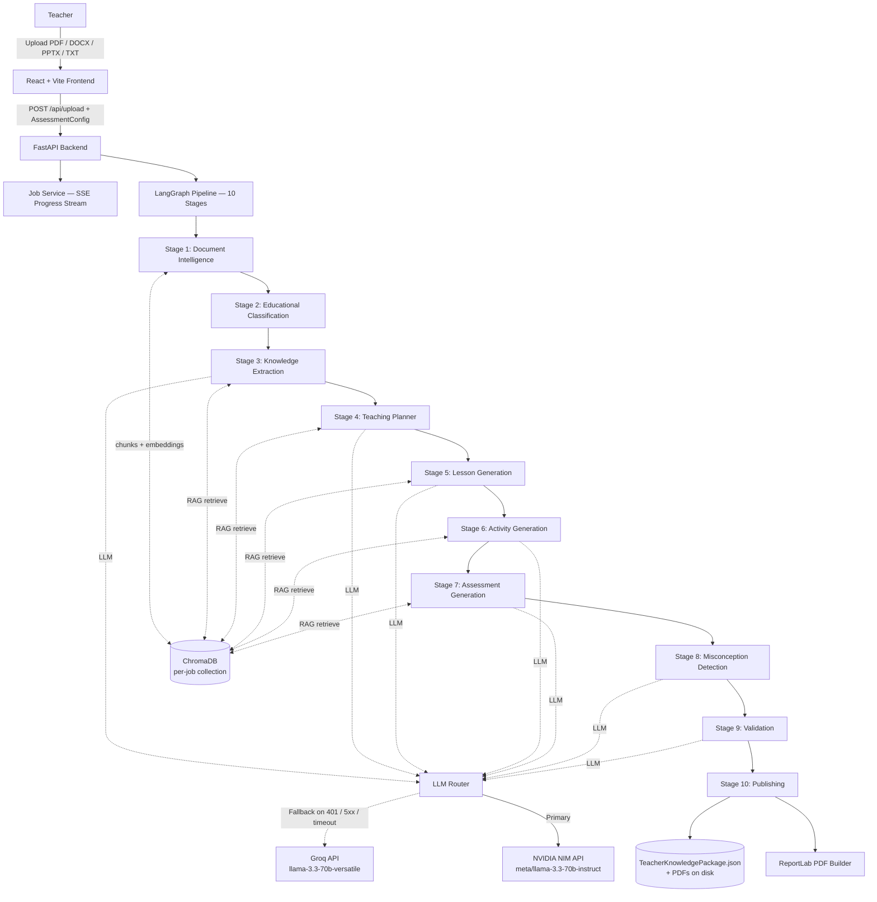

<div align="center">


# 🎓 GuruZ — Teacher AI Platform

**Upload any educational document. Get a classroom-ready Teacher Knowledge Package in minutes.**

[](https://fastapi.tiangolo.com/)
[](https://langchain-ai.github.io/langgraph/)
[](https://react.dev/)
[](https://www.trychroma.com/)
[](https://www.python.org/)
[](https://www.typescriptlang.org/)
[](LICENSE)

[**Live Demo**](#) · [**Sample Outputs**](./samples/) · [**API Docs**](#-api-reference) · [**Quick Start**](#-running-locally)

</div>

---

## ✨ What is GuruZ?

GuruZ is an AI-powered platform built for the **AI Engineer Assignment: Teacher AI Platform**. It transforms raw educational documents — textbook chapters, research papers, lecture notes, slide decks — into fully structured, classroom-ready **Teacher Knowledge Packages (TKPs)** through a **10-stage LangGraph pipeline**.

Teachers upload a single document. GuruZ returns:

| Component | What's inside |
|---|---|
| 📅 **Lesson Plans** | Multi-period plans with entry tickets, teacher scripts, blackboard notes, exit tickets, and homework |
| 📖 **Teacher Guide** | Subject/grade/difficulty metadata, learning objectives, concepts, definitions, formulae, and applications |
| 📝 **Assessment Book** | MCQs, short/long answers, numerical problems, case studies, HOTS, and diagram questions — with answer key |
| 🎮 **Classroom Activities** | Demonstrations, role plays, experiments, group work — with materials, instructions, and success criteria |
| ⚠️ **Misconception Radar** | Identified student misconceptions with severity level, diagnostic questions, and remedial actions |
| 🔍 **Validation Report** | Hallucination risk score, completeness check, schema validity, and issue list |
| 📄 **PDF Exports** | Lesson Plan PDF · Teacher Guide PDF · Assessment Book PDF — all downloadable |

---

## 🏗️ Architecture



---

## 🤖 10-Stage AI Pipeline

Each stage is an isolated async LangGraph node. State flows through a typed `PipelineState` dict; any stage failure short-circuits the rest with a structured error.

| # | Stage | Agent | What it does |
|---|---|---|---|
| 1 | **Document Intelligence** | `DocumentParserAgent` | Parses PDF/DOCX/PPTX/TXT with PyMuPDF → pypdf → OCR fallback chain. Chunks text and indexes into a per-job ChromaDB collection. Auto-detects language. |
| 2 | **Educational Classification** | `EducationalClassifierAgent` | Infers subject, topic, chapter, grade, difficulty (`beginner/intermediate/advanced`), category (`STEM/Humanities/…`), and language. |
| 3 | **Knowledge Extraction** | `KnowledgeExtractorAgent` | RAG-grounded extraction of learning objectives, prerequisites, concepts (core / supporting / supplementary), definitions, formulae, examples, applications, and keywords. |
| 4 | **Teaching Planner** | `TeachingPlannerAgent` | Builds a multi-period teaching strategy — splits content into N periods of configurable duration, each with sequenced objectives and topics. |
| 5 | **Lesson Generation** | `LessonGeneratorAgent` | Generates full lesson content per period: Entry Ticket, Teacher Script, Blackboard Notes, Checkpoint Questions, Exit Ticket, Homework, and Mentor Moment. |
| 6 | **Activity Generation** | `ActivityGeneratorAgent` | Designs diverse activities (demonstration, role_play, experiment, discussion, project, game, field_work, group_work) with materials, instructions, and success criteria. |
| 7 | **Assessment Generation** | `AssessmentGeneratorAgent` | Creates a configurable `AssessmentBank`: MCQs, Short/Long answers, Numerical problems, Case Studies, HOTS questions, Diagram questions — with answer keys and rubrics. |
| 8 | **Misconception Detection** | `MisconceptionDetectorAgent` | Identifies student misconceptions with severity (low/medium/high), diagnostic questions, and remedial actions — all RAG-sourced. |
| 9 | **Validation** | `ValidationAgent` | Checks JSON schema validity, hallucination risk, completeness score, objective coverage, and source chunk traceability. Returns `ValidationReport`. |
| 10 | **Publishing** | `PublisherAgent` | Saves `TeacherKnowledgePackage.json` to disk and exports three PDFs via ReportLab. Marks job as `completed`. |

> **RAG-grounded throughout** — every generation stage retrieves relevant chunks from the per-job ChromaDB collection, keeping all output traceable to source text.

---

## 📡 Streaming Progress API

The frontend subscribes to real-time pipeline progress via **Server-Sent Events (SSE)**:

```
GET /api/jobs/{job_id}/events
```

Each event payload:
```json
{
  "stage": "lesson_generation",
  "stage_index": 4,
  "total_stages": 10,
  "progress": 60,
  "message": "Generating period 3 of 5...",
  "overall_progress": 46
}
```

Overall progress is calculated as a weighted average across all 10 stages.

---

## 🗂️ Folder Structure

```
GuruZ-V1/
├── backend/
│   ├── app/
│   │   ├── agents/                   # One file per pipeline stage
│   │   │   ├── base_agent.py         # Shared base class
│   │   │   ├── document_parser_agent.py
│   │   │   ├── educational_classifier.py
│   │   │   ├── knowledge_extractor.py
│   │   │   ├── teaching_planner.py
│   │   │   ├── lesson_generator.py
│   │   │   ├── activity_generator.py
│   │   │   ├── assessment_generator.py
│   │   │   ├── misconception_detector.py
│   │   │   ├── validation_agent.py
│   │   │   └── publisher.py
│   │   ├── workflows/
│   │   │   └── pipeline.py           # LangGraph StateGraph — 10 nodes
│   │   ├── rag/
│   │   │   ├── parser.py             # PyMuPDF → pypdf → OCR fallback
│   │   │   ├── chunker.py            # Configurable chunk/overlap
│   │   │   ├── embedder.py           # ChromaDB ingestion
│   │   │   └── retriever.py          # Semantic retrieval
│   │   ├── models/
│   │   │   └── llm_router.py         # NVIDIA primary + Groq fallback
│   │   ├── routers/                  # FastAPI route handlers
│   │   │   ├── upload.py             # POST /upload + AssessmentConfig form
│   │   │   ├── jobs.py               # Job CRUD + SSE stream
│   │   │   ├── packages.py           # Package JSON + PDF download
│   │   │   ├── health.py
│   │   │   ├── settings.py
│   │   │   └── logs.py
│   │   ├── schemas/
│   │   │   ├── teacher_package.py    # Full TKP + AssessmentConfig schema
│   │   │   └── job.py                # Job, StageProgress, STAGES
│   │   ├── services/
│   │   │   ├── job_service.py
│   │   │   ├── storage.py
│   │   │   ├── pdf_export.py
│   │   │   └── pdf_builder.py        # ReportLab PDF construction
│   │   ├── utils/
│   │   │   ├── logger.py             # Structured logging + in-memory buffer
│   │   │   ├── text_cleaner.py
│   │   │   ├── text_utils.py
│   │   │   └── language_utils.py
│   │   └── config.py                 # pydantic-settings from .env
│   ├── requirements.txt
│   └── tests/
│       ├── test_api.py
│       ├── test_agents.py
│       └── test_rag.py
├── artifacts/
│   └── teacher-platform/             # React + Vite + Tailwind frontend
│       └── src/
│           ├── pages/                # dashboard, upload, jobs, packages, settings, logs
│           └── components/ui/        # Radix-based component library
├── lib/
│   ├── api-client-react/             # Auto-generated typed API client
│   └── api-zod/                      # Auto-generated Zod validation schemas
├── samples/                          # ≥ 2 sample TeacherKnowledgePackage.json files
├── data/                             # Runtime: uploads, packages, ChromaDB
└── README.md
```

---

## 🛠️ Tech Stack

<table>
<tr>
<td valign="top" width="50%">

**Backend**
- 🐍 Python 3.12+
- ⚡ FastAPI + Uvicorn
- 🔗 LangGraph (StateGraph pipeline orchestration)
- 🗄️ ChromaDB (per-job vector store)
- 📄 PyMuPDF + pypdf + OCR (parsing chain)
- 📝 ReportLab (PDF export)
- 📁 python-docx, python-pptx (DOCX/PPTX parsing)
- 🌐 httpx (async LLM API calls)
- ✅ Pydantic v2 + pydantic-settings

</td>
<td valign="top" width="50%">

**Frontend**
- ⚛️ React 18 + TypeScript
- ⚡ Vite
- 🎨 Tailwind CSS + Radix UI
- 🔄 @tanstack/react-query (data fetching)
- 🧭 wouter (routing)
- 📊 Pages: Dashboard, Upload, Jobs, Job Detail, Packages, Package Detail, Settings, Logs

**Shared**
- Auto-generated typed API client (`lib/api-client-react`)
- Auto-generated Zod schemas (`lib/api-zod`)

</td>
</tr>
</table>

---

## 🔀 LLM Provider Routing

The `LLMRouter` uses **NVIDIA NIM as primary** and **Groq as fallback** with automatic health-aware switching:

```
LLM_PROVIDER=auto  →  NVIDIA checked first → Groq if NVIDIA unavailable
LLM_PROVIDER=nvidia → NVIDIA only, no fallback
LLM_PROVIDER=groq  → Groq only
```

**Fallback triggers:** 401 / 403 (auth), 5xx (server error), timeout, or network failure.
**Retry-in-place triggers:** 429 (rate limit with Retry-After header) and 413 (payload too large — prompt is shrunk by 30% and retried).

---

## 📋 Assessment Configuration

Teachers can pass an `AssessmentConfig` alongside the upload to control exactly what is generated:

```json
{
  "mcq_count": 10,
  "include_mcq": true,
  "include_short_answer": true,
  "include_long_answer": true,
  "include_numerical": true,
  "include_case_study": true,
  "include_hots": true,
  "include_diagram": false,
  "include_answer_key": true
}
```

MCQs include 4 options, correct index, explanation, difficulty (`easy/medium/hard`), and source chunk references.

---

## 🔍 Validation Report

Every package ships with an automated validation result:

| Field | Description |
|---|---|
| `overall_score` | Aggregate quality score (0–1) |
| `hallucination_score` | LLM output vs. RAG source grounding |
| `completeness_score` | Fraction of learning objectives covered |
| `schema_valid` | Pydantic schema adherence |
| `all_objectives_covered` | Boolean coverage check |
| `source_chunks_verified` | RAG traceability confirmed |
| `is_valid` | Final pass/fail verdict |
| `issues` | List of `{severity, field, message}` validation issues |

---

## 📡 API Reference

| Method | Endpoint | Description |
|---|---|---|
| `GET` | `/healthz` | Liveness probe |
| `GET` | `/health/detailed` | LLM provider status, ChromaDB status |
| `POST` | `/upload` | Upload document + optional `AssessmentConfig` form field |
| `GET` | `/jobs` | List all jobs |
| `GET` | `/jobs/{job_id}` | Job status + stage progress |
| `DELETE` | `/jobs/{job_id}` | Cancel / delete job |
| `GET` | `/jobs/{job_id}/events` | **SSE stream** — real-time stage progress |
| `GET` | `/packages` | List completed packages |
| `GET` | `/packages/{package_id}` | Full `TeacherKnowledgePackage.json` |
| `DELETE` | `/packages/{package_id}` | Delete package |
| `GET` | `/packages/{package_id}/download/{doc_type}` | Download PDF (`lesson_plan`, `teacher_guide`, `assessment_book`) |
| `GET` | `/settings` | Runtime configuration |
| `GET` | `/logs` | Recent structured logs |
| `DELETE` | `/logs` | Clear log buffer |

---

## ⚙️ Configuration

Copy `backend/.env.example` to `backend/.env` and fill in your keys:

| Variable | Default | Purpose |
|---|---|---|
| `LLM_PROVIDER` | `nvidia` | `auto`, `nvidia`, or `groq` |
| `NVIDIA_API_KEY` | *(required)* | NVIDIA NIM API key |
| `NVIDIA_BASE_URL` | `https://integrate.api.nvidia.com/v1` | NVIDIA endpoint |
| `NVIDIA_MODEL` | `meta/llama-3.3-70b-instruct` | NVIDIA model |
| `GROQ_API_KEY` | *(optional)* | Groq API key (fallback) |
| `GROQ_MODEL` | `llama-3.3-70b-versatile` | Groq model |
| `CHROMA_PERSIST_DIR` | `./data/chroma` | ChromaDB persistence path |
| `CHUNK_SIZE` | `512` | RAG chunk size in tokens |
| `CHUNK_OVERLAP` | `64` | RAG chunk overlap |
| `MAX_RETRY_ATTEMPTS` | `3` | LLM retry count |
| `PERIOD_DURATION_MINUTES` | `40` | Default lesson period length |
| `DEFAULT_LANGUAGE` | `English` | Fallback language |
| `UPLOAD_DIR` | `./data/uploads` | Uploaded file storage |
| `PACKAGES_DIR` | `./data/packages` | Package JSON + PDF storage |
| `PORT` | `8080` | Backend port |
| `BASE_PATH` | `/api` | API prefix |

---

## 🚀 Running Locally

### Prerequisites
- Python 3.12+ (required for ChromaDB on Windows)
- Node.js 18+ and pnpm ([install pnpm](https://pnpm.io))
- At least one LLM API key (NVIDIA or Groq)

### Backend

```powershell
cd backend
python -m venv .venv
.\.venv\Scripts\activate       # Windows
# source .venv/bin/activate    # macOS / Linux
pip install -r requirements.txt
copy .env.example .env         # Windows
# cp .env.example .env         # macOS / Linux
# Edit .env — add NVIDIA_API_KEY and/or GROQ_API_KEY
python -m uvicorn app.main:app --reload --host 0.0.0.0 --port 8080
```

Backend will be available at `http://localhost:8080/api` · Swagger UI at `http://localhost:8080/docs`

### Frontend

```powershell
cd artifacts/teacher-platform
pnpm install
pnpm dev
```

Frontend available at `http://localhost:5173`

### Run Both Together

```powershell
# From repo root
./run.ps1
```

---

## 🐛 Troubleshooting

| Issue | Fix |
|---|---|
| `chromadb` fails to install on Windows | Ensure Python 3.12 is active — not 3.13 |
| `pnpm: command not found` | Install from https://pnpm.io |
| ChromaDB runtime crash | Verify `CHROMA_PERSIST_DIR` has write permissions |
| NVIDIA 401 error | Check `NVIDIA_API_KEY` is set correctly in `.env` |
| Pipeline hangs on first run | NVIDIA health check can take ~10s; set `LLM_PROVIDER=groq` to skip |
| PDF missing Indic characters | Known limitation — see roadmap |

---

## ⚠️ Known Limitations

- Jobs are **in-memory** — they do not survive a server restart
- PDF export does not yet fully render Indic scripts (Devanagari, Tamil, etc.)
- Validation scoring is heuristic (LLM self-evaluation + schema checks)
- No user authentication — single-tenant deployment only
- Max file size: **50 MB**

---

## 🔭 Roadmap

> Contributions welcome — open an issue or PR!

### 🌐 Language & Localization
- [ ] **Full multi-language pipeline stability** — end-to-end support for Hindi, Tamil, Telugu, Marathi, Bengali
- [ ] Proper Indic script rendering in PDF exports (Devanagari, Tamil lipi, etc.)
- [ ] Auto-detection and handling of mixed-language documents
- [ ] RTL script support in UI and exports (Arabic, Urdu)

### 📝 Question & Assessment Engine
- [ ] **Teacher-controlled question generation** — choose types (MCQ, short, long, numerical, HOTS, diagram), count, and topic focus from the UI
- [ ] **Difficulty level selector** — Easy / Medium / Hard / Mixed per assessment section, per question type
- [ ] Bloom's Taxonomy tagging on every question (Remember → Evaluate → Create)
- [ ] Question bank — save, reuse, and shuffle questions across packages
- [ ] Improved MCQ distractor quality via RAG-grounded wrong-answer generation

### 📦 Export Formats & Downloads
- [ ] **Multi-format package export** — PDF, JSON, PPTX (slide deck), DOCX, XLSX (grade sheet)
- [ ] Auto-generated PowerPoint from lesson plan stages
- [ ] SCORM / LMS-compatible export for Moodle, Google Classroom, Canvas
- [ ] Zip bundle — all formats in one click

### 🎨 PDF & Document Design
- [ ] **Branded, attractive PDF templates** with cover page, section dividers, color themes
- [ ] Teacher-selectable themes (minimal, colorful, print-optimized)
- [ ] Math / LaTeX rendering in PDFs
- [ ] Inline concept maps and diagrams in exported documents

### ⚙️ Flexibility & Customization
- [ ] **Per-period duration and count** configurable per-upload (not just a global env var)
- [ ] In-UI package editor — edit any generated section before export
- [ ] Subject-specific templates (Science lab, Language arts, Math drill)
- [ ] Curriculum alignment — CBSE, ICSE, NCERT, Common Core, IB

### 🤖 AI & API
- [ ] **Expanded LLM provider support** — OpenAI GPT-4o, Anthropic Claude, Google Gemini, Mistral, Ollama (local)
- [ ] Per-stage model selection — fast model for classification, stronger model for lesson generation
- [ ] Streaming text generation in the UI (see content appear token-by-token)
- [ ] Teacher feedback loop — thumbs up/down to improve future runs
- [ ] Agent memory for iterative package refinement without full re-run

### 🖥️ UI / UX
- [ ] **Redesigned package builder** — drag-and-drop period reordering, live preview panel
- [ ] Dark mode
- [ ] Mobile-responsive layout
- [ ] In-browser lesson editor before export
- [ ] Estimated time remaining per pipeline stage
- [ ] Onboarding wizard for first-time users

### 🏗️ Infrastructure
- [ ] Persistent job storage (survive restarts) via SQLite or Redis
- [ ] Docker Compose one-command setup
- [ ] Background job queue (ARQ / Celery) for concurrent document processing
- [ ] User authentication and multi-tenant package management
- [ ] Observability dashboard — latency per stage, token cost, error rates

---

## 📁 Sample Outputs

Two example `TeacherKnowledgePackage.json` files are provided in [`/samples`](./samples/):

| Sample | Subject | Grade | Periods |
|---|---|---|---|
| `sample_1_photosynthesis.json` | Biology — Photosynthesis | Grade 9 | 5 × 40 min |
| `sample_2_french_revolution.json` | History — French Revolution | Grade 10 | 4 × 40 min |

---

<div align="center">

**Built with ❤️ using FastAPI · LangGraph · ChromaDB · React · ReportLab**

> 📁 Python dependencies: `backend/requirements.txt` — source of truth for all backend packages.

</div>
