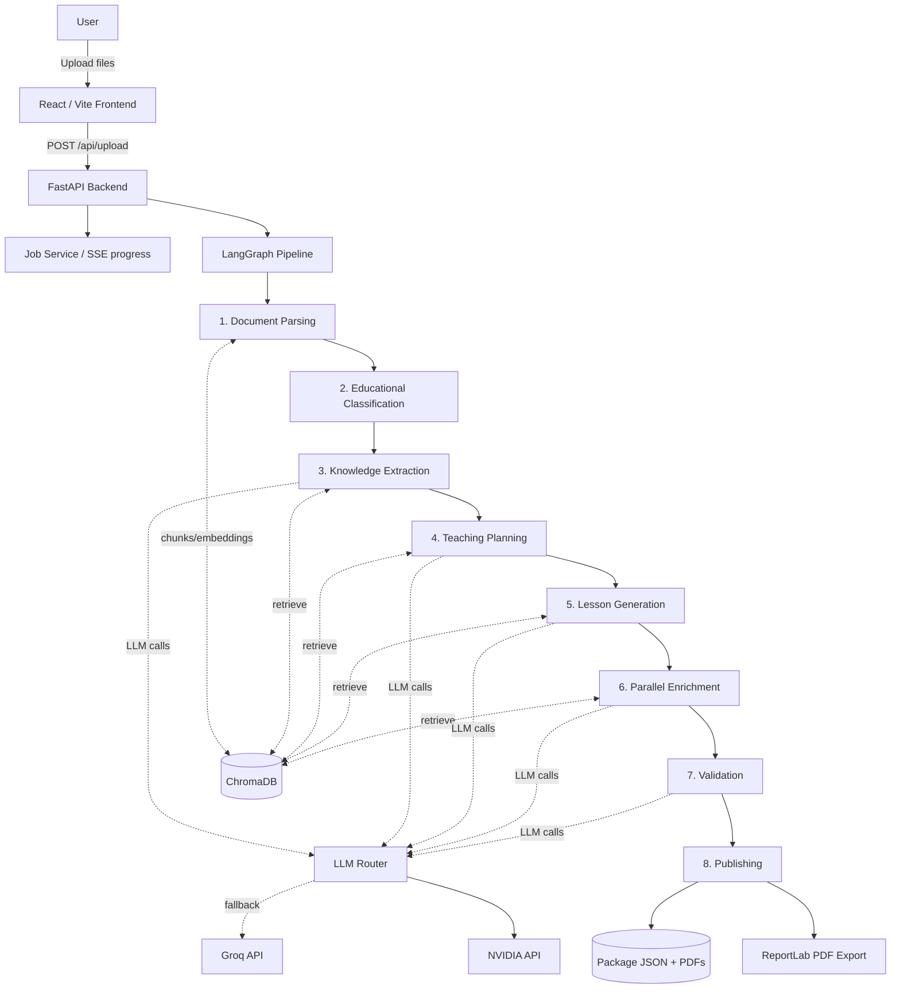

# GuruZ — Knowledge Package Platform

GuruZ turns raw educational documents — textbook chapters, lecture notes, slide decks, worksheets, or any mix of these — into a structured, classroom-ready **Teacher Knowledge Package**.

Each generated package includes:
- multi-period lesson plans
- a teacher guide
- an assessment book with answer key
- classroom activities
- misconception detection and remediation
- PDF exports for download

The app is built with a FastAPI + LangGraph backend and a React + Vite frontend, backed by ChromaDB for retrieval-augmented generation.

---

## Table of contents

- [Features](#features)
- [Architecture](#architecture)
- [Folder structure](#folder-structure)
- [Tech stack](#tech-stack)
- [AI pipeline](#ai-pipeline)
- [Parser & RAG pipeline](#parser--rag-pipeline)
- [Validation](#validation)
- [API reference](#api-reference)
- [Configuration / environment variables](#configuration--environment-variables)
- [Running locally](#running-locally)
- [Troubleshooting](#troubleshooting)
- [Known limitations](#known-limitations)
- [Future improvements](#future-improvements)

---

## Features

- **Multi-format ingestion** — PDF, DOCX, PPTX, TXT
- **RAG-grounded generation** — ChromaDB retrieval keeps output linked to source text
- **LLM provider routing** — support for NVIDIA and Groq with health-aware fallback
- **Validation reporting** — schema checks, hallucination risk, completeness, and issue lists
- **PDF export** — lesson plan, teacher guide, assessment book
- **Frontend dashboard** — real-time system status, jobs, and package details

## Architecture



## Folder structure

```
GuruZ-V1/
├── backend/
│   ├── app/
│   │   ├── agents/          # pipeline agents
│   │   ├── workflows/       # LangGraph pipeline definition
│   │   ├── rag/             # parser, chunker, embedder, retriever
│   │   ├── models/          # llm_router.py and provider router
│   │   ├── routers/         # FastAPI routes
   │   │   ├── health.py
│   │   │   ├── jobs.py
│   │   │   ├── packages.py
   │   │   ├── settings.py
   │   │   └── upload.py
│   │   ├── schemas/         # Pydantic models
│   │   ├── services/        # PDF export, storage, job service
   │   ├── utils/           # logging and text helpers
   │   └── config.py
│   ├── requirements.txt
│   └── tests/
├── artifacts/
│   └── teacher-platform/   # React + Vite frontend
├── lib/
│   ├── api-client-react/   # generated frontend API client
│   └── api-zod/            # generated Zod schemas
├── data/                   # persisted uploads, packages, ChromaDB
└── README.md
```

## Tech stack

**Backend**
- Python 3.12+
- FastAPI
- Uvicorn
- Pydantic v2 / pydantic-settings
- LangGraph
- chromadb
- httpx
- reportlab, PyMuPDF, python-docx, python-pptx

**Frontend**
- React
- TypeScript
- Vite
- Tailwind CSS
- Radix UI
- @tanstack/react-query
- wouter

**Shared**
- Generated API client in `lib/api-client-react`
- Generated Zod types in `lib/api-zod`

## AI pipeline

The main pipeline is defined in `backend/app/workflows/pipeline.py`.
It uses a LangGraph state graph and passes a mutable state through each agent stage.

### Pipeline stages

1. `DocumentParserAgent` — parse uploads, chunk text, index ChromaDB
2. `EducationalClassifier` — infer subject/topic/grade/language/type
3. `KnowledgeExtractor` — extract objectives, concepts, definitions, examples
4. `TeachingPlanner` — build period-by-period lesson structure
5. `LessonGenerator` — generate lesson content and teacher script
6. parallel enrichment — activities, assessments, misconceptions
7. `ValidationAgent` — validate package quality and grounding
8. `Publisher` — save package JSON and export PDFs

## Parser & RAG pipeline

- Uploaded documents are parsed into normalized text.
- Text is chunked and embedded into ChromaDB.
- Later stages retrieve relevant chunks to ground generation.
- Each job uses its own per-job ChromaDB collection.

## Validation

Validation output includes:
- `overall_score`
- `hallucination_score`
- `completeness_score`
- `schema_valid`
- `all_objectives_covered`
- `source_chunks_verified`
- `issues`

The frontend shows a validation summary in package details.

## API reference

| Method | Path | Purpose |
|--------|------|---------|
| `GET` | `/healthz` | Liveness check |
| `GET` | `/health/detailed` | Detailed health status |
| `POST` | `/upload` | Upload documents and start processing |
| `GET` | `/jobs` | List jobs |
| `GET` | `/jobs/{job_id}` | Job status |
| `DELETE` | `/jobs/{job_id}` | Cancel/delete job |
| `GET` | `/jobs/{job_id}/events` | SSE progress stream |
| `GET` | `/packages` | List packages |
| `GET` | `/packages/{package_id}` | Package JSON |
| `DELETE` | `/packages/{package_id}` | Delete package |
| `GET` | `/packages/{package_id}/download/{doc_type}` | Download PDF |
| `GET` | `/settings` | Runtime settings |
| `GET` | `/logs` | Recent logs |
| `DELETE` | `/logs` | Clear logs |

## Configuration / environment variables

| Variable | Default | Purpose |
|----------|---------|---------|
| `LLM_PROVIDER` | `auto` | `auto`, `nvidia`, or `groq` |
| `NVIDIA_API_KEY` | *(empty)* | NVIDIA API key |
| `NVIDIA_BASE_URL` | `https://integrate.api.nvidia.com/v1` | NVIDIA endpoint |
| `NVIDIA_MODEL` | `meta/llama-3.3-70b-instruct` | NVIDIA model |
| `GROQ_API_KEY` | *(empty)* | Groq API key |
| `GROQ_MODEL` | `llama-3.3-70b-versatile` | Groq model |
| `CHROMA_PERSIST_DIR` | `./data/chroma` | ChromaDB path |
| `CHUNK_SIZE` | `512` | RAG chunk size |
| `CHUNK_OVERLAP` | `64` | RAG chunk overlap |
| `MAX_RETRY_ATTEMPTS` | `3` | LLM retry count |
| `PERIOD_DURATION_MINUTES` | `40` | Default lesson period length |
| `DEFAULT_LANGUAGE` | `English` | Fallback language |
| `UPLOAD_DIR` | `./data/uploads` | Upload storage |
| `PACKAGES_DIR` | `./data/packages` | Package storage |
| `PORT` | `8080` | Backend port |
| `BASE_PATH` | `/api` | API prefix |

## Running locally

### Backend

```powershell
cd backend
python -m venv .venv
.\.venv\Scripts\activate
pip install -r requirements.txt
copy .env.example .env
# edit backend/.env with your keys
python -m uvicorn app.main:app --reload --host 0.0.0.0 --port 8080
```

### Frontend

```powershell
cd artifacts/teacher-platform
pnpm install
pnpm dev
```

### Run both

```powershell
# from repo root
./run.ps1
```

## Troubleshooting

- Use Python 3.12 on Windows for `chromadb`.
- If `pnpm` is missing, install it from https://pnpm.io.
- If ChromaDB fails, verify `CHROMA_PERSIST_DIR` permissions.

## Known limitations

- Jobs are in-memory and do not survive restart.
- PDF export may not fully shape complex Indic scripts.
- Validation is heuristic and based on LLM output.

## Future improvements

- persistent job storage
- improved PDF shaping and math rendering
- stronger curriculum alignment

---

> Note: This repo uses `backend/requirements.txt` as the Python dependency source of truth.
